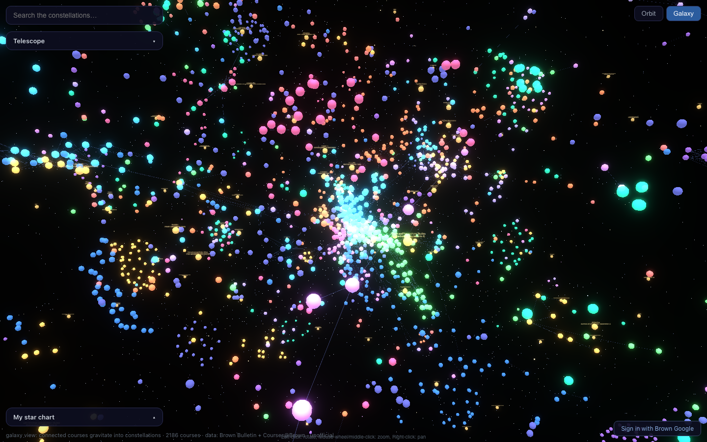

# Brown Course Constellations

An interactive 3D galaxy of Brown University's undergraduate curriculum: every
course is a star, prerequisites form constellation lines, and concentrations
anchor the clusters that feed them.

**Live**: <https://brown-concentration-graph.vercel.app>



**Unofficial student project.** Always confirm requirements against the
[Brown Bulletin](https://bulletin.brown.edu) and your concentration advisor.

## Features

- **3D galaxy map** (react-force-graph-3d + three.js): 2,186 courses in
  cosmic-palette department clusters, with a 4-layer starfield and bloom glow.
  Two layouts: **Galaxy** (pure force, default) and **Orbit** (courses circle
  the concentrations they feed; height = prerequisite depth).
- **Click any star**: full course description, official prerequisite text,
  live seat-demand bar, what it unlocks, and which of the 168 concentration
  tracks it counts toward.
- **Focus mode**: selecting a course or concentration collapses the sky to its
  prerequisite constellation / requirement tree with animated chain particles.
- **Telescope filters**: department, course level, unconnected stars.
- **My star chart**: mark courses taken or planned. Guests get localStorage;
  signing in with a **Brown Google account** syncs plans to Postgres (and
  migrates any local data).
- **Dashboard** (`/me`): per-concentration progress bars (taken vs. planned),
  plus every course your completed classes unlock.

## Architecture

```
pipeline/   TypeScript scrapers + graph builder (runs locally / CI)
  scrape-index.ts     bulletin concentration list
  scrape-all.ts       requirement tables -> ALL / CHOOSE_N / SERIES trees
  scrape-prereqs.ts   official prereq text from Courses@Brown (headless)
  scrape-details.ts   descriptions + seat capacity/availability
  export-json.ts      graph assembly, sanity checks, palette
  layouts-3d.ts       precomputed galaxy (d3-force-3d) + orbit layouts
  load-neo4j.ts       optional Neo4j AuraDB load (Cypher exploration)
web/        Next.js app on Vercel
  static graph.json (no runtime DB for the map)
  Auth.js v5: Google sign-in restricted to @brown.edu
  Neon serverless Postgres: users + plan_courses
```

## Data sources & caveats

- Concentration requirements: [Brown Bulletin](https://bulletin.brown.edu)
  (2026-27), 88 concentrations / 168 degree tracks parsed from CourseLeaf
  tables. Unparseable prose rows are flagged in `data/review/`, never guessed.
- Prerequisites: **official only**, from Courses@Brown registration
  restrictions. AP/IB score alternatives and instructor-permission clauses are
  shown verbatim but not modeled as edges.
- Courses not offered since ~2023 have no CAB entry (no description/seats).
- Seat data is a snapshot of the most recent offered term.

## Development

```bash
# data refresh (order matters; ~40 min total, cached + resumable)
cd pipeline
npx tsx src/scrape-index.ts && npx tsx src/scrape-all.ts
npx tsx src/scrape-prereqs.ts && npx tsx src/scrape-details.ts
npx tsx src/export-json.ts && npx tsx src/layouts-3d.ts

# web
cd web
cp .env.example .env.local   # DATABASE_URL, AUTH_GOOGLE_ID/SECRET, AUTH_SECRET
node scripts/migrate.mjs     # one-time schema
npm run dev

# tests
cd pipeline && npx vitest run   # parsers, graph assembly
cd web && npx vitest run        # graph lib, unlock/progress logic
```
